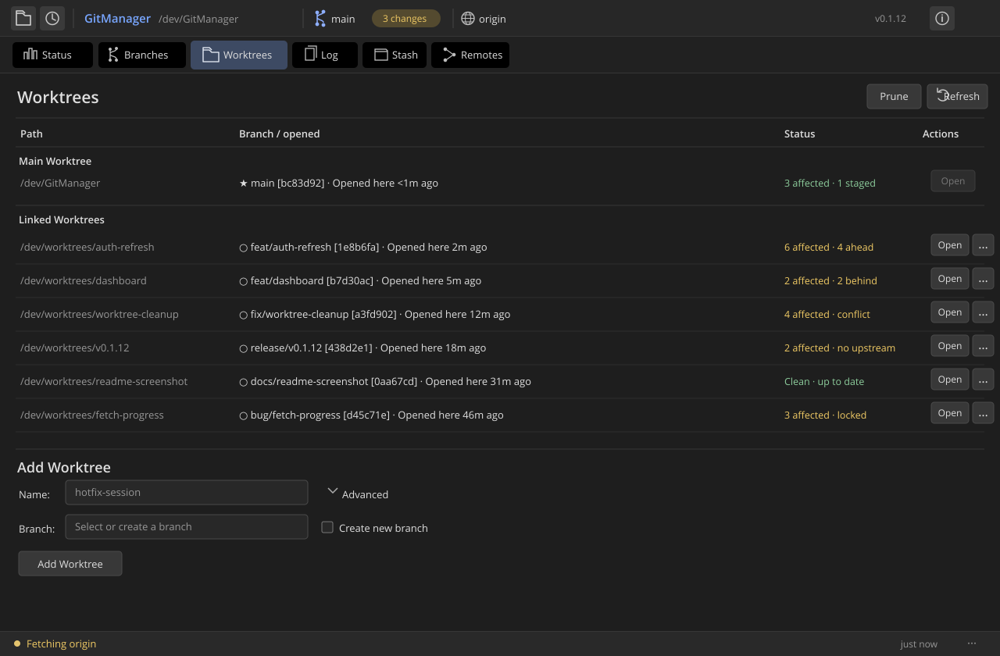

# Git Manager

[](https://github.com/JohnXu22786/GitManager/actions/workflows/ci.yml)

Git Manager is a lightweight desktop Git client for developers working across multiple branches and worktrees. Its worktree-first view helps you see workspace state, reopen a workspace inside the app, and review cleanup before removing it.



*Illustrative workspace data shows concurrent branch and worktree activity.*

## Quick start

1. Open or clone a repository.
2. Use the Worktrees view to create a worktree from an existing or new branch.
3. Open the worktree inside Git Manager, review its local and upstream state, and inspect the cleanup preview before removal.

The `Opened here` label uses Git Manager's recent-open history only. It does not track activity in terminals, editors, or other applications; no history entry does not mean a worktree is unused.

## Scope

Git Manager focuses on local branch and worktree operations. It does not create pull requests or launch coding agents.

## Features

- Review repository status, inspect diffs, stage or unstage files, and commit changes.
- Create, open, prune, and safely remove Git worktrees.
- Compare worktree change counts, upstream/merge state, lock state, and recent opens inside Git Manager.
- Create, switch, rename, merge, and safely delete branches.
- Browse and search commit history, and manage stashes.
- Configure remotes and run fetch, pull, and push operations.
- Clone repositories and reopen recently used repositories.
- Check for and install releases from within the application.

## Download and install

Download a release archive from [GitHub Releases](https://github.com/JohnXu22786/GitManager/releases). The workflow publishes these targets:

| Platform | Release asset |
| --- | --- |
| Linux x86_64 | `git-manager-<version>-linux-x86_64.tar.gz` |
| Linux ARM64 | `git-manager-<version>-linux-aarch64.tar.gz` |
| Windows x86_64 | `git-manager-<version>-windows-x86_64.zip` |
| macOS Intel | `git-manager-<version>-macos-x86_64.tar.gz` |
| macOS Apple silicon | `git-manager-<version>-macos-aarch64.tar.gz` |

Use the release version in the asset name; the release workflow removes a leading `v` from the tag. Archives contain the application binary, not a platform installer. macOS releases are command-line executables rather than `.app` bundles.

### Linux

Extract the archive and run the binary:

```sh
tar -xzf git-manager-<version>-linux-x86_64.tar.gz
./git_manager
```

Use the `linux-aarch64` archive on ARM64. The Linux build uses GTK 3, WebKitGTK 4.1, X11, and XCB libraries. On Debian or Ubuntu, install the development packages before building from source:

```sh
sudo apt-get install libgtk-3-dev libwebkit2gtk-4.1-dev libx11-dev libxcb1-dev
```

Runtime library availability can vary by distribution and version.

### Windows

Extract the `windows-x86_64` ZIP archive and run `git_manager.exe` from the extracted files.

### macOS

Extract the archive, then run the binary from Terminal:

```sh
tar -xzf git-manager-<version>-macos-aarch64.tar.gz
chmod +x git_manager
./git_manager
```

Use the `macos-x86_64` archive for Intel Macs.

Git Manager can check the latest GitHub release and offer an update for supported platforms. Updates are downloaded from the project's GitHub Releases page.

## Build from source

Install the stable Rust toolchain with Cargo. On Linux, install the libraries listed above. On macOS, install the Xcode Command Line Tools. On Windows, use the MSVC Rust toolchain and its Visual C++ build tools.

```sh
cargo run
cargo build --release
cargo test --all-targets
```

The CI workflow runs the test suite on Ubuntu, macOS, and Windows. Release builds are produced for the platforms listed above.

## License

Git Manager is licensed under the GNU General Public License, version 3 or (at your option) any later version. See [LICENSE](LICENSE).
